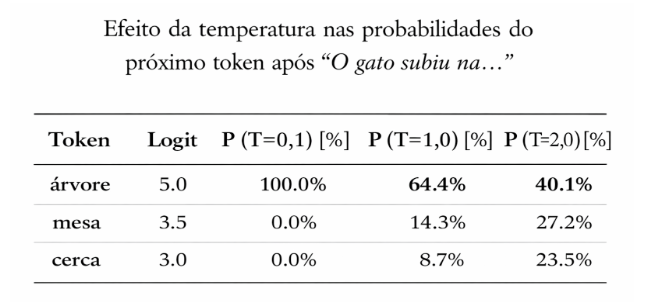
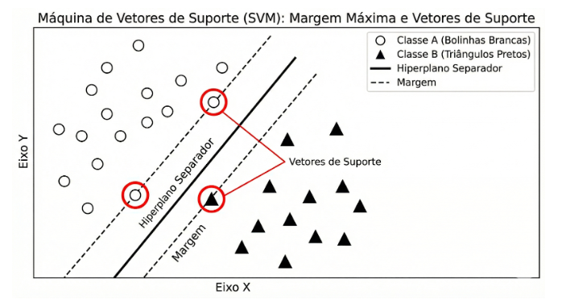
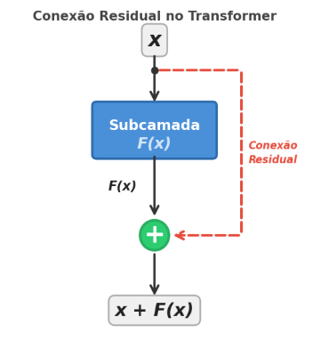
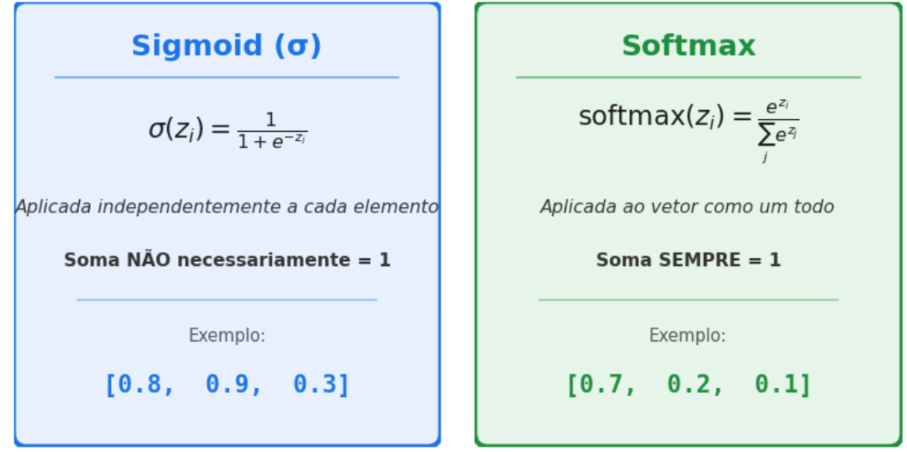
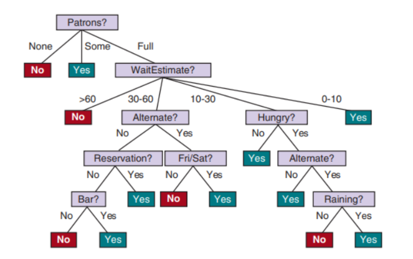
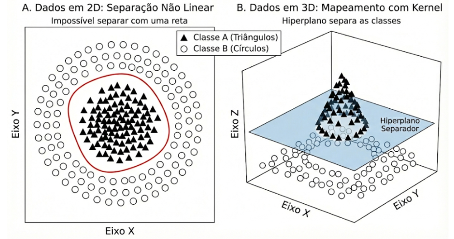
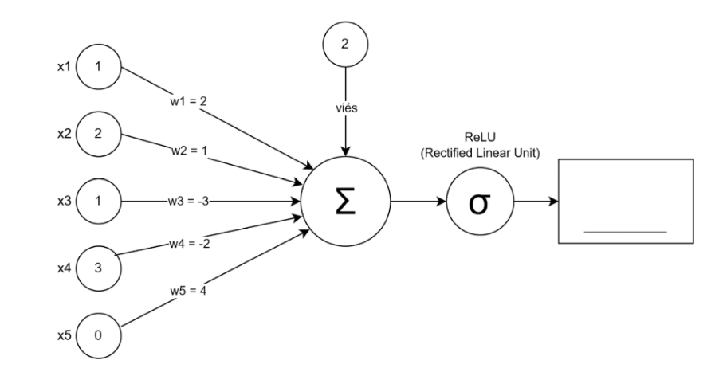
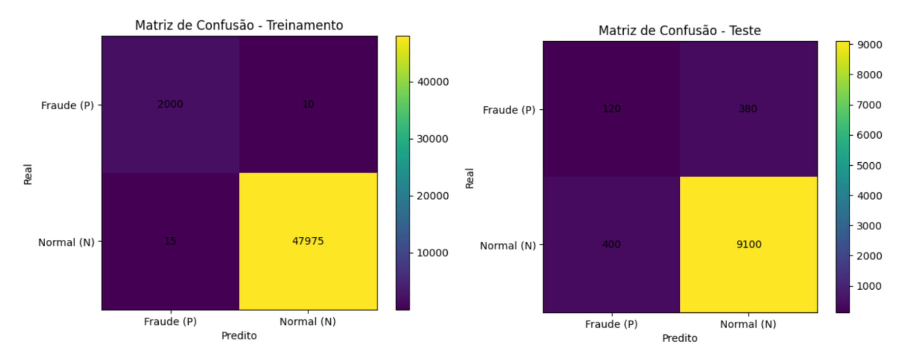
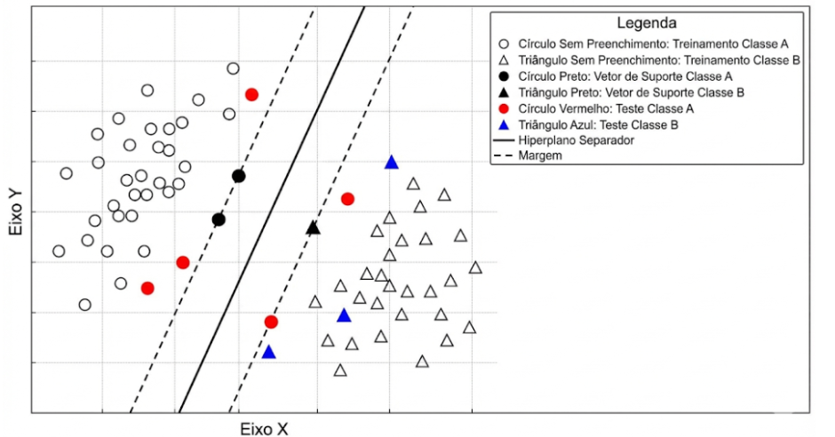

# 2ª ONIA - 3ª Fase - Alunos [8º ano EF ao 3º ano do EM]
SEJA MUITO BEM-VINDO(A)! A 2ª edição da Olimpíada Nacional de Inteligência Artificial (ONIA) é um evento aberto e gratuito voltado para jovens e dividido em três categorias. Consiste em uma ação exclusivamente cultural e recreativa, sendo a participação voluntária e desvinculada da aquisição de qualquer bem, serviço ou direito. Esta prova de 3ª fase é individual, online, mas sem consulta livre. Siga nossas redes sociais. www.instagram.com/oniabrasil Você precisará consultar as redes sociais para acompanhar a divulgação de resultados e dos polos de aplicação das fases presenciais. Os certificados usarão este nome na emissão. Indique também corretamente cidade, escola e estado. Você consegue editar teus dados, para que a gente consiga saber sua escola e sua cidade. Boa prova!

## Questão 1
Uma escola deseja desenvolver um sistema para ajudar alunos a organizarem seus estudos antes das provas finais. O desafio é que muitos estudantes relatam sentir que "há conteúdo demais" e não sabem por onde começar.

Ao projetar o sistema, a equipe decide que ele deverá:
* Primeiro, listar todas as disciplinas com prova marcada.
* Depois, dividir cada disciplina em tópicos menores (por exemplo: em Matemática -> funções, geometria, estatística).
* Em seguida, estimar o tempo médio necessário para revisar cada tópico.
* Por fim, distribuir esses blocos de estudo ao longo dos dias disponíveis até a prova.

Durante os testes, a equipe percebe que os alunos passam a visualizar melhor o volume real de conteúdo e conseguem cumprir o cronograma com mais consistência.

Qual é a principal razão pela qual essa estratégia torna o problema mais administrável para os alunos?

A) Porque o sistema utiliza inteligência artificial para prever as notas finais.
B) Porque transforma um problema amplo e abstrato em unidades menores.
C) Porque elimina automaticamente os tópicos mais difíceis do cronograma.
D) Porque reduz a quantidade total de conteúdo exigido nas provas.
E) Porque substitui completamente a necessidade de planejamento individual.

---

## Questão 2
Um estudante de Ciência de Dados escreveu um algoritmo em Python para avaliar o desempenho de um modelo de Inteligência Artificial logo após o treinamento. Ele extraiu os valores de uma Matriz de Confusão, mas ao criar a função, esqueceu de nomear corretamente as variáveis das métricas, chamando-as apenas de metrica_X, metrica_Y e metrica_Z.
Analise o trecho de código abaixo:

```python
def avaliar_modelo(TP, TN, FP, FN):
    # TP: Verdadeiros Positivos | TN: Verdadeiros Negativos
    # FP: Falsos Positivos      | FN: Falsos Negativos
    
    metrica_X = TP / (TP + FP)

    metrica_Y = TP / (TP + FN)
    
    metrica_Z = 2 * (metrica_X * metrica_Y) / (metrica_X + metrica_Y)
    
    return metrica_X, metrica_Y, metrica_Z

    # Resultados extraídos do teste do modelo:
    TP = 30
    TN = 80
    FP = 20
    FN = 70

    x, y, z = avaliar_modelo(TP, TN, FP, FN)
```

Realizando o teste de mesa (cálculo passo a passo) do código acima, qual das alternativas a seguir indica corretamente os valores numéricos impressos nas variáveis x, y e z e os respectivos nomes teóricos que essas métricas recebem na área de Machine Learning?

A) x = 0.60 (Precisão), y = 0.30 (Recall), z = 0.40 (F1-Score).
B) x = 0.60 (Recall), y = 0.30 (Precisão), z = 0.40 (F1-Score).
C) x = 0.60 (Precisão), y = 0.30 (Recall), z = 0.55 (Acurácia).
D) x = 0.30 (Precisão), y = 0.60 (Recall), z = 0.45 (F1-Score).
E) x = 0.55 (Acurácia), y = 0.30 (Recall), z = 0.40 (Precisão).

---

## Questão 3
Um hospital universitário está desenvolvendo um modelo de IA para auxiliar na detecção precoce de uma doença genética rara, que afeta aproximadamente 1% da população.

Após os testes iniciais, a equipe obtém os seguintes resultados no conjunto de validação:
* Precisão (Precision): 92%
* Sensibilidade (Recall): 28%

Os médicos percebem que o sistema quase nunca acusa a doença quando o paciente está saudável. No entanto, muitos pacientes que realmente possuem a condição não são identificados pelo modelo.

Considerando as definições formais das métricas:
* Precisão = entre os casos previstos como positivos, quantos realmente são positivos.
* Recall = entre os casos realmente positivos, quantos foram corretamente identificados.

Qual interpretação é mais adequada para esse cenário?

A) O modelo identifica corretamente a maioria dos pacientes doentes, mas apresenta muitos falsos positivos.
B) O modelo raramente classifica pacientes saudáveis como doentes, porém deixa de identificar grande parte dos casos reais da doença.
C) O modelo apresenta equilíbrio adequado entre falsos positivos e falsos negativos, sendo apropriado para triagem populacional.
D) O modelo está superajustado aos dados de treino, o que explica a discrepância entre precisão e recall.
E) O modelo apresenta alta variância estatística, indicando instabilidade na predição de ambas as classes.

---

## Questão 4
Após o treinamento inicial, modelos de linguagem (LLMs) podem ser refinados utilizando Aprendizado por Reforço (RL). Uma técnica popular é o GRPO (Group Relative Policy Optimization), que funciona da seguinte forma simplificada:

1. Para cada pergunta, o modelo gera K respostas diferentes (amostras).
2. Cada resposta recebe uma recompensa (reward) com base em algum critério de qualidade.
3. O modelo é atualizado para aumentar a probabilidade de gerar respostas com alta recompensa e diminuir a probabilidade de gerar respostas com baixa recompensa.

Um conceito importante nesse processo é o reward hacking (exploração da recompensa): o modelo pode aprender a maximizar a recompensa de maneiras não intencionais, encontrando "atalhos" que satisfazem o critério de recompensa sem realmente melhorar a qualidade geral das respostas.

Uma forma de controlar esse comportamento, é usar um parâmetro de divergência KL, que penaliza o modelo quando ele se afasta demais do modelo original (referência), evitando mudanças drásticas no comportamento.

Considere a seguinte situação: um engenheiro tem um LLM que frequentemente responde no idioma errado (por exemplo, responde em inglês quando o usuário pergunta em português). Ele decide aplicar RL com GRPO usando a seguinte função de recompensa:
* +1 se a resposta está no idioma correto
* -1 se a resposta está no idioma errado

Após o treinamento, o modelo passa a responder consistentemente no idioma correto. Porém, a precisão das respostas caiu drasticamente — o conteúdo das respostas ficou muito pior.

O que explica esse resultado e qual seria a melhor forma de mitigá-lo?

A) O modelo não teve dados suficientes para aprender a responder no idioma correto. A solução é gerar mais amostras (aumentar K) durante o treinamento de RL.
B) O modelo aprendeu a priorizar respostas no idioma correto independentemente de estarem certas. Para mitigar, pode-se usar uma função de recompensa que também avalie acurácia e/ou aumentar o peso da penalidade de divergência KL.
C) O problema é que GRPO não é adequado para tarefas de linguagem. A solução seria usar exclusivamente fine-tuning supervisionado (SFT) com dados no idioma correto.
D) A recompensa negativa (-1) causou instabilidade numérica no treinamento. A solução é usar apenas recompensas positivas (por exemplo, +1 para idioma correto e 0 para idioma errado).
E) O modelo sofreu overfitting nos dados de treinamento de RL. A solução é reduzir o número de épocas de treinamento até encontrar o equilíbrio entre idioma e precisão.

---

## Questão 5
Modelos de linguagem (LLMs) geram texto token por token. A cada passo, o modelo calcula uma pontuação (chamada logit) para cada token do vocabulário, indicando quão provável ele é como próximo token. Essas pontuações são convertidas em probabilidades usando a função softmax.

Um parâmetro chamado temperatura (T) pode ser aplicado antes do softmax para controlar a "criatividade" do modelo.

Para ilustrar, considere que o modelo está gerando a próxima palavra após "O gato subiu na" e os três tokens mais prováveis têm os seguintes logits:



Baseado na tabela acima e no conceito de temperatura, qual afirmação é INCORRETA?

A) Com temperatura baixa (T -> 0), a distribuição de probabilidade se torna mais "pontiaguda", concentrando quase toda a probabilidade no token com maior logit. O modelo se torna mais determinístico e previsível.
B) Com temperatura alta (T -> ∞), a distribuição se torna mais uniforme, aproximando-se de probabilidades iguais para todos os tokens. O modelo se torna mais "criativo" mas também mais imprevisível e propenso a gerar texto sem sentido.
C) Temperatura T = 1.0 corresponde ao comportamento padrão do modelo, sem nenhuma modificação na distribuição de probabilidade.
D) A temperatura modifica os pesos internos do modelo a cada inferência, recalibrando as camadas de atenção para produzir respostas mais ou menos criativas.
E) Uma estratégia comum é usar temperatura baixa para tarefas que exigem precisão (como código ou matemática) e temperatura alta para tarefas criativas (como escrita de ficção ou brainstorming).

---

## Questão 6
Modelos de linguagem (LLMs) não "leem" texto diretamente: eles primeiro transformam o texto em tokens usando um tokenizador (por exemplo, BPE/WordPiece/Unigram). Em geral, quanto mais tokens um texto vira, maior o custo de treino e inferência (mais passos de atenção, mais memória e tempo), e maior a chance de "estourar" o limite de contexto.

Um pesquisador compara dois tokenizadores para treinar um modelo voltado ao português:
* Tokenizador A (multilíngue): treinado em muitos idiomas, com um vocabulário compartilhado.
* Tokenizador B (dedicado ao português): treinado majoritariamente em corpora em português, com o mesmo tamanho de vocabulário do A.

Ele faz um teste em textos em português e observa:
* O Tokenizador A gera, em média, 30% mais tokens por texto do que o Tokenizador B.
* O modelo treinado com o Tokenizador A tem custo de inferência maior e, em prompts longos, parece "perder" detalhes mais cedo.

Considere as afirmações:

I. É esperado que um tokenizador dedicado ao português produza menos tokens em textos em português, pois tende a aprender subpalavras mais frequentes e adequadas ao idioma (ex.: "ção", "mente", "nh", "lh"), reduzindo fragmentação.
II. Se o tokenizador A gera 30% mais tokens em média, então, mantendo o mesmo comprimento máximo de contexto (por exemplo, 4096 tokens), o modelo com A consegue "ver" menos conteúdo em caracteres/palavras do que com B, o que pode afetar desempenho em tarefas que dependem de contexto longo.
III. A melhor forma de resolver isso é aumentar o tamanho do vocabulário do tokenizador multilíngue indefinidamente, porque isso sempre reduz o número de tokens sem nenhum custo ou efeito colateral.
IV. Em modelos Transformer, reduzir o número de tokens de entrada pode melhorar a eficiência de inferência: com menos tokens, geralmente há menos operações e menos uso de memória (especialmente no mecanismo de atenção), podendo reduzir latência e aumentar throughput — embora o ganho exato dependa da implementação e do comprimento do contexto.

A alternativa correta é:

A) Somente I e IV.
B) Somente II e III.
C) I, II e IV.
D) I, II, III e IV.
E) Somente III.

---

## Questão 7
Um grupo de pesquisa compara dois datasets para treinar um modelo de classificação médica:
* Dataset A: 5 milhões de exemplos, 20% das labels possuem ruído.
* Dataset B: 800 mil exemplos, com labels revisadas por especialistas (ruído praticamente zero).

Após treinamento com o mesmo orçamento computacional, o modelo treinado com o Dataset B apresenta melhor desempenho no conjunto de teste limpo.

Qual é a explicação mais tecnicamente consistente?

A) O modelo treinado com menos dados sempre generaliza melhor.
B) O Dataset A sofreu underfitting por ser muito grande.
C) O tamanho do dataset não influencia desempenho quando se usa Transformer.
D) O ruído nas labels reduz a eficiência amostral e pode introduzir gradientes inconsistentes durante o treinamento.
E) O problema decorre exclusivamente da escolha da função de ativação.

---

## Questão 8
Na área de Machine Learning, a técnica conhecida como Máquina de Vetores de Suporte (SVM – do Inglês Support Vector Machines) tenta encontrar a melhor "reta" (hiperplano de separação) para separar duas classes de dados, buscando a "rua" mais larga possível entre elas. Na figura acima, os três pontos destacados que tocam os limites dessa "rua" tracejada recebem o nome especial de Vetores Suporte. Se você deletasse do gráfico todos os outros pontos que não estão destacados e treinasse o algoritmo novamente, o que aconteceria com a reta separadora?



A) A reta desapareceria, pois o algoritmo precisa de muitos dados espalhados para conseguir calcular qualquer reta.
B) A reta separadora ficaria exatamente no mesmo lugar, pois apenas os vetores suporte são necessários para defini-la.
C) A reta mudaria de inclinação drasticamente, pois os pontos mais distantes são os que mais atraem a reta.
D) O modelo daria um erro, pois os vetores de suporte são, na verdade, os ruídos (dados incorretos) que devem ser apagados.
E) A reta se transformaria em um círculo para tentar englobar os três pontos restantes.

---

## Questão 9
Na arquitetura Transformer, cada bloco é composto por subcamadas como Self-Attention (autoatenção) e FFN (rede feed-forward). Um detalhe importante do design é que, em cada subcamada, a entrada original é somada à saída da subcamada antes de passar adiante. Ou seja, se a entrada de uma subcamada é $x$ e a subcamada computa uma função $F(x)$, o resultado final dessa etapa não é simplesmente $F(x)$, mas sim:
saída = $x + F(x)$

Essa operação é chamada de conexão residual (residual connection) ou skip connection. Observe o diagrama simplificado de um bloco Transformer:



Por que essa técnica é fundamental para treinar Transformers com muitas camadas?

A) A conexão residual serve para aumentar a dimensionalidade dos vetores, permitindo que o modelo represente informações mais complexas a cada camada.
B) A conexão residual é usada para implementar regularização (como dropout), evitando overfitting durante o treinamento.
C) A conexão residual melhora o fluxo de gradientes durante o backpropagation.
D) A conexão residual é necessária porque a subcamada de Self-Attention destrói a informação original da entrada, e sem a soma o modelo perderia todo o conteúdo semântico dos tokens.
E) A conexão residual é uma técnica opcional que melhora levemente o desempenho, mas Transformers profundos podem ser treinados sem ela sem grandes problemas.

---

## Questão 10
Em redes neurais, as funções de ativação são responsáveis por transformar os valores de saída de uma camada. Duas funções muito conhecidas produzem valores entre 0 e 1:



Considere dois problemas de classificação de imagens:
* Problema A: Dada uma foto, classificar o animal como gato, cachorro ou pássaro (a imagem contém exatamente um animal).
* Problema B: Dada uma foto, identificar quais objetos estão presentes entre: pessoa, carro, árvore (a imagem pode conter vários objetos ao mesmo tempo).

Analise as afirmações:
I - No Problema A, devemos usar softmax na camada de saída, pois as classes são mutuamente exclusivas e precisamos de uma distribuição de probabilidade válida que some 1.
II - No Problema B, devemos usar sigmoid na camada de saída de forma independente.
III - Substituir softmax por sigmoid no Problema A seria aceitável sem consequências, pois ambas as funções produzem valores entre 0 e 1.

A alternativa correta é:

A) Somente I.
B) Somente III.
C) I e II.
D) II e III.
E) I, II e III.

---

## Questão 11

Árvores de decisão são construídas a partir do quão relevante é um atributo ou *feature* para a tomada de **decisão final**, nesse sentido, quão mais próximo da raíz, mais informações aquele atributo fornece. Em outras palavras, o atributo de maior qualidade decisiva detém o maior ganho de informação. Na figura abaixo, entre os atributos *Raining*, *Hungry* e *WaitEstimate*, qual é o atributo, respectivamente, de maior e o de menor ganho de informação?



A) WaitEstimate e Alternate
B) WaitEstimate e Raining
C) Alternate e Raining
D) Raining e WaitEstimate
E) Raining e Alternate

---

## Questão 12

O problema é que fazer esse mapeamento para espaços de dimensão muito alta consome um poder computacional gigantesco. Para contornar esse obstáculo, o algoritmo faz uso do chamado Truque do Núcleo (mais conhecido pelo termo em inglês "*Kernel Trick*"). O que esse "truque" faz?



A) Ele apaga todas as dimensões do problema, transformando o gráfico 3D em uma linha de texto (1D) para economizar espaço de armazenamento.
B) Ele calcula a distância (produto escalar) entre os pontos como se eles estivessem na dimensão superior, sem precisar realmente desenhá-los ou transportá-los para essa nova dimensão.
C) Ele treina várias redes neurais profundas ao mesmo tempo e depois tira a média dos resultados para descobrir onde a curva deve ser desenhada.
D) Ele corta o gráfico original em formato de pizza, separando os dados por pedaços menores para desenhar dezenas de pequenas retas 2D em vez de ir para o 3D.
E) Ele pede a interferência de um usuário humano na tela para circular com o mouse onde está o grupo central e, assim, ensina a máquina.

---

## Questão 13

Às vezes, os dados estão misturados de tal forma que nenhuma linha reta consegue separá-los (problema não-linearmente separável). O 'Truque do Kernel' (Kernel Trick) resolve isso de forma elegante. O que ele faz essencialmente?


A) Ele projeta os dados em uma dimensão maior onde uma separação linear é possível.
B) Ele transforma a SVM em uma Rede Neural de várias camadas.
C) Ele reduz a quantidade de dimensões para simplificar o problema.
D) Ele troca os rótulos das classes para facilitar o acerto.
E) Ele apaga os pontos que estão atrapalhando a separação.

---

## Questão 14

Modelos de linguagem (LLMs) não “leem” texto diretamente: eles primeiro transformam o texto em **tokens** usando um **tokenizador** (por exemplo, BPE/WordPiece/Unigram). Em geral, quanto **mais tokens** um texto vira, maior o custo de **treino** e **inferência** (mais passos de atenção, mais memória e tempo), e maior a chance de “estourar” o limite de contexto.

Um pesquisador compara dois tokenizadores para treinar um modelo voltado ao **português**:

* **Tokenizador A (multilíngue):** treinado em muitos idiomas, com um vocabulário compartilhado.
* **Tokenizador B (dedicado ao português):** treinado majoritariamente em corpora em português, com o mesmo tamanho de vocabulário do A.

Ele faz um teste em textos em português e observa:
* O Tokenizador A gera, em média, **30% mais tokens** por texto do que o Tokenizador B.
* O modelo treinado com o Tokenizador A tem custo de inferência maior e, em prompts longos, parece “perder” detalhes mais cedo.

Considere as afirmações:

I. É esperado que um tokenizador dedicado ao português produza menos tokens em textos em português, pois tende a aprender subpalavras mais frequentes e adequadas ao idioma (ex.: “ção”, “mente”, “nh”, “lh”), reduzindo fragmentação.

II. Se o tokenizador A gera 30% mais tokens em média, então, mantendo o mesmo comprimento máximo de contexto (por exemplo, 4096 tokens), o modelo com A consegue “ver” menos conteúdo em caracteres/palavras do que com B, o que pode afetar desempenho em tarefas que dependem de contexto longo.

III. A melhor forma de resolver isso é **aumentar o tamanho do vocabulário** do tokenizador multilíngue indefinidamente, porque isso sempre reduz o número de tokens sem nenhum custo ou efeito colateral.

IV. Em modelos Transformer, reduzir o número de tokens de entrada pode melhorar a eficiência de inferência: com menos tokens, geralmente há menos operações e menos uso de memória (especialmente no mecanismo de atenção), podendo reduzir latência e aumentar throughput — embora o ganho exato dependa da implementação e do comprimento do contexto.

A alternativa correta é:

A) Somente I e IV.
B) Somente II e III.
C) I, II e IV.
D) I, II, III e IV.
E) Somente III.

---

## Questão 15

Um Perceptron calcula sua saída de forma direta: ele multiplica cada valor de entrada pelo seu respectivo peso, soma todos esses resultados junto com um valor fixo chamado viés (bias) e passa o total por uma função de ativação. Imagine que um neurônio de um sistema antifraude de um banco está avaliando uma transação suspeita baseando-se em 5 características numéricas. Os valores de entrada (x) recebidos e os pesos (w) definidos pela rede são:

* Entrada 1 (x_1): 1 | Peso 1 (w_1): 2
* Entrada 2 (x_2): 2 | Peso 2 (w_2): 1
* Entrada 3 (x_3): 1 | Peso 3 (w_3): -3
* Entrada 4 (x_4): 3 | Peso 4 (w_4): -2
* Entrada 5 (x_5): 0 | Peso 5 (w_5): 4
* O **viés (bias)** programado para esse neurônio é **2**.

Para decidir o valor final, o neurônio utiliza a função de ativação **ReLU** (Rectified Linear Unit).



Qual será o resultado final (saída) gerado por esse neurônio?

A) -3
B) -2
C) -5
D) 1
E) 0

---

## Questão 16

Um pesquisador está treinando uma rede neural profunda com 20 camadas ocultas totalmente conectadas para classificar imagens médicas. A arquitetura utiliza:

* Inicialização padrão dos pesos
* Função de ativação **sigmoid** em todas as camadas ocultas
* Otimizador baseado em gradiente descendente
* Backpropagation

Durante o treinamento, ele observa que:
* As últimas camadas apresentam atualizações de peso significativas.
* As primeiras camadas quase não sofrem atualização.
* A norma dos gradientes decresce exponencialmente à medida que retropropaga pelas camadas.
* O erro de treino estagna rapidamente.

Após análise matemática, ele conclui que o problema está relacionado ao fato de que a derivada da função sigmoid está limitada ao intervalo (0, 0.25), o que, ao ser multiplicado repetidamente ao longo de muitas camadas, leva a gradientes extremamente pequenos.

Qual modificação arquitetural é mais adequada para mitigar esse problema mantendo a profundidade da rede?

A) Substituir a função sigmoid por ReLU ou variantes, reduzindo a saturação e preservando gradientes maiores em regiões ativas.
B) Aumentar significativamente a taxa de aprendizado para compensar a diminuição da magnitude dos gradientes.
C) Remover os termos de viés (bias), reduzindo a complexidade paramétrica da rede.
D) Aumentar o tamanho do dataset de forma com que dado um número suficiente de épocas, o modelo irá convergir corretamente.
E) Reduzir o número de camadas da rede para evitar a perda de informação devido à redução da representatividade numérica.

---

## Questão 17

Uma fintech desenvolveu um modelo usando 300 variáveis comportamentais para prever fraude em cartões de crédito. O modelo foi treinado em 50.000 transações e testado em 10.000 novas transações. Classe positiva = fraude.



Números dentro dos gráficos:
Treinamento: 2000 - 10 / 15 - 47975
Teste: 120 - 380 / 400 - 9100

A) O modelo está pronto para produção, pois a acurácia no teste é superior a 92%.
B) O modelo apresenta overfitting devido à grande diferença entre recall no treino e no teste.
C) O modelo apresenta alta capacidade de generalização, pois o desempenho no teste permanece elevado mesmo com 300 variáveis.
D) O modelo apresenta apenas problema de threshold.
E) O modelo apresenta precisão no teste superior a 50%.

---

## Questão 18

Em Machine Learning, após o computador desenhar a fronteira de decisão de um SVM usando os dados de treinamento e os vetores de suporte (em preto, que definem as margens de separação), nós precisamos medir se essa reta é realmente boa para prever novos eventos. Para isso, apresentamos dados inéditos (os dados de teste coloridos em vermelho e azul) e observamos de que lado da reta eles caíram. Para resumir os acertos e erros do modelo, os cientistas utilizam uma ferramenta chamada Matriz de Confusão.

Neste problema, vamos considerar que o objetivo (**Classe Positiva**) era encontrar os elementos da Classe A (**círculos vermelhos**). Assim, qualquer dado de teste que caia no lado esquerdo da reta recebe uma "Predição Positiva", e qualquer dado no lado direito recebe uma "Predição Negativa". Avaliando apenas os 8 dados de teste coloridos descritos na figura, quais seriam os valores exatos de Verdadeiros Positivos (TP), Falsos Positivos (FP), Verdadeiros Negativos (TN) e Falsos Negativos (FN) da nossa Matriz de Confusão?



A) TP: 4, FP: 0, TN: 2, FN: 2
B) TP: 3, FP: 2, TN: 3, FN: 0
C) TP: 3, FP: 0, TN: 3, FN: 2
D) TP: 5, FP: 0, TN: 3, FN: 0
E) A matriz de confusão não pode ser calculada para um gráfico de SVM, pois ela só serve para modelos não supervisionados como os de agrupamento (Clustering).

---

## Questão 19

Uma universidade quer reduzir evasão e reprovação. Para isso, criou um programa de intervenção chamado “Fica Mais Um”, que oferece: monitoria extra, trilhas de revisão, atendimento psicopedagógico, bolsa de internet (para quem precisa). Só que o orçamento é limitado: o programa só consegue atender no máximo 600 alunos por semestre. Então a reitoria pede um modelo que identifique alunos com alto risco de reprovação para priorizar quem deve entrar no programa.

Contexto do dataset: Você recebe dados de 10.000 alunos do semestre anterior (base de treino/validação), com features como frequência, acessos ao Moodle, entregas atrasadas, etc.
A variável-alvo é:
* “reprovado” (classe positiva: aluno precisa de intervenção)
* “aprovado” (classe negativa)
Distribuição real observada: 9.500 aprovados / 500 reprovados.

O "modelo baseline": Um analista júnior argumenta: “Se eu sempre prever ‘aprovado’, vou ter uma acurácia enorme. É um ótimo baseline e talvez até suficiente.” Esse modelo, portanto, nunca prevê “reprovado”.

Considerando acurácia, precisão, recall e F1 (com foco na classe reprovado), qual alternativa descreve melhor o desempenho desse modelo?

A) A acurácia será baixa, pois o modelo falha no objetivo principal do projeto (detectar reprovados).
B) A acurácia será alta, mas o recall para reprovado será 0, e o F1 para reprovado também será 0.
C) A precisão para reprovado será alta, porque o modelo evita alarmes falsos e por isso quase sempre acerta quando “pensa” em reprovar.
D) O recall para reprovado será alto, pois como é uma classe rara, prever "aprovado" não prejudica a detecção de casos raros.
E) O modelo pode ser considerado bom, pois em cenários desbalanceados a acurácia é a métrica mais confiável e suficiente para decisão.

---

## Questão 20

Ainda sobre o texto da questão anterior, considerando acurácia, precisão, recall e F1 (com foco na classe reprovado, que é a rara e a mais importante para intervenção), qual alternativa descreve melhor o desempenho desse modelo?


A) A acurácia será baixa, pois o modelo falha no objetivo principal do projeto (detectar reprovados).
B) A acurácia será alta, mas o recall para reprovado será 0, e o F1 para reprovado também será 0.
C) A precisão para reprovado será alta, porque o modelo evita alarmes falsos e por isso quase sempre acerta quando “pensa” em reprovar.
D) O recall para reprovado será alto, pois como é uma classe rara, prever “aprovado” não prejudica a detecção de casos raros.
E) O modelo pode ser considerado bom, pois em cenários desbalanceados a acurácia é a métrica mais confiável e suficiente para decisão.